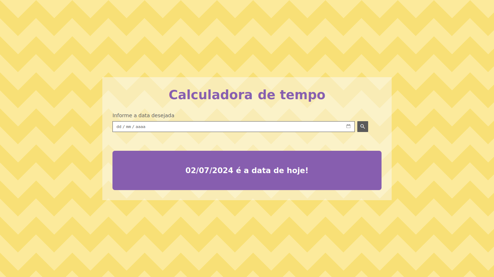
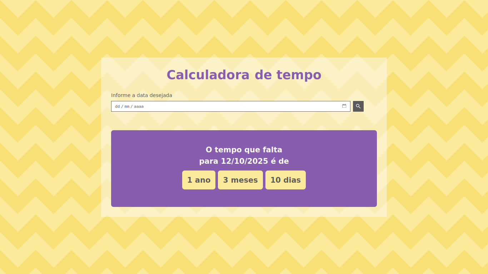
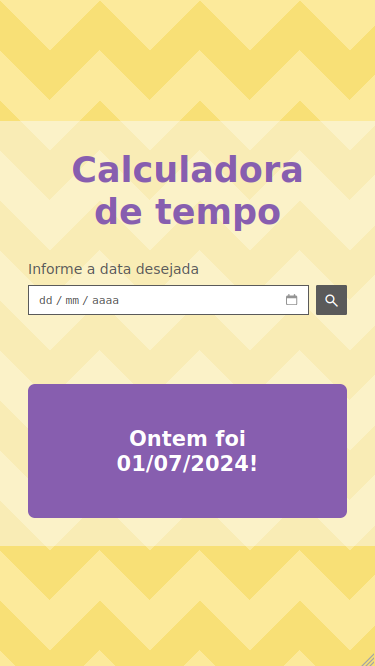
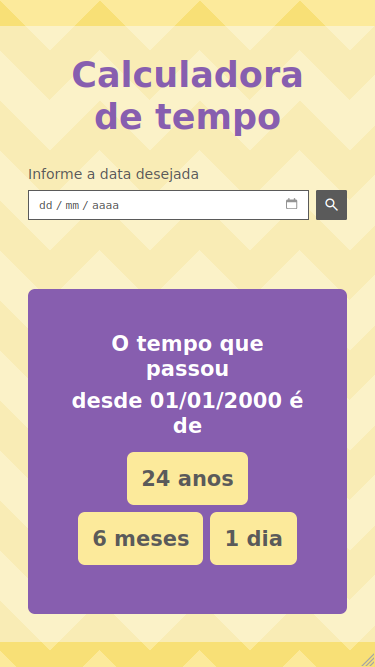

# :hourglass: Calculadora de tempo

Aplicação desenvolvida com JavaScript puro que apresenta uma calculadora de tempo entre o dia atual e uma data específica. A partir da data definida pelo usuário, informa-se quanto tempo se passou ou quanto tempo falta para que se chegue ao dado dia. O resultado apresenta o período no formato de dias, meses e anos.

## :gear: Tecnologias

- HTML
- CSS
- JavaScript

## :art: Layout

